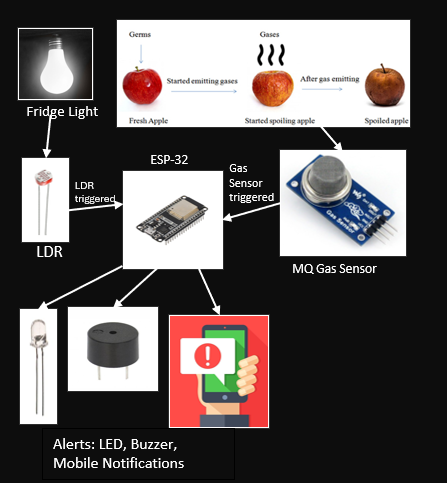

# IoT Smart Monitoring System for Refrigeration

## Overview
An ESP32-based IoT system that monitors refrigerator conditions such as door status, gas leaks, and food spoilage. The system provides real-time alerts and cloud-based monitoring to improve safety and efficiency.

## Features
- Door status detection using LDR
- Gas leak detection using MQ-2 sensor
- Food spoilage detection using MQ-3 sensor
- Real-time alerts via Pushbullet API
- Cloud data logging using ThingSpeak

## Hardware Components
- ESP32 Microcontroller
- MQ-2 Gas Sensor
- MQ-3 Alcohol Sensor
- LDR (Light Dependent Resistor)
- Buzzer and LEDs

## System Architecture
Sensors → ESP32 (ADC Processing) → Threshold Logic → Alerts + Cloud (ThingSpeak)

## Tech Stack
- ESP32 (Embedded C / Arduino)
- ThingSpeak (Cloud)
- Pushbullet API (Notifications)

## My Contribution
- Integrated ESP32 with multiple sensors
- Debugged sensor readings and threshold logic
- Validated system behavior across real-world scenarios
- Implemented cloud logging and alert system

## Future Improvements
- Add temperature and humidity sensing
- Improve sensor calibration accuracy
- Develop mobile app dashboard

## System Workflow

